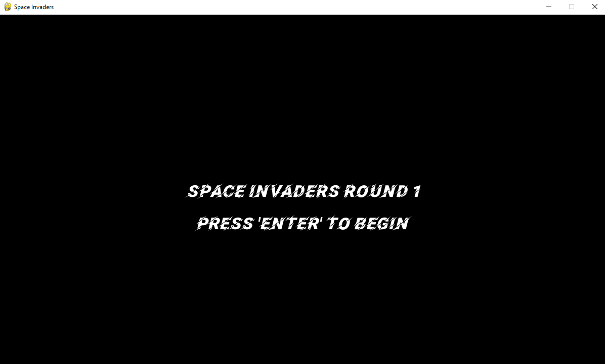
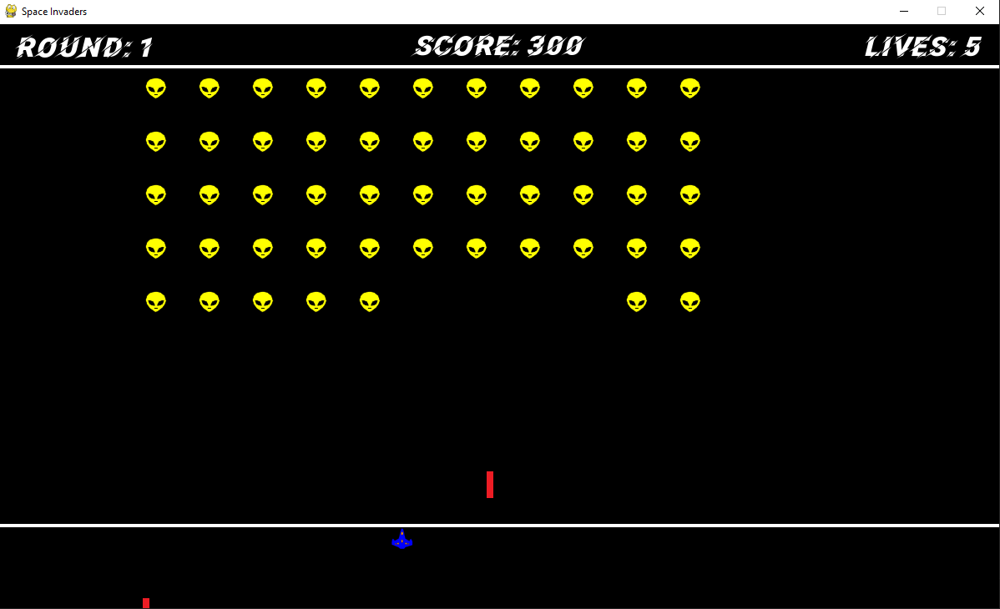
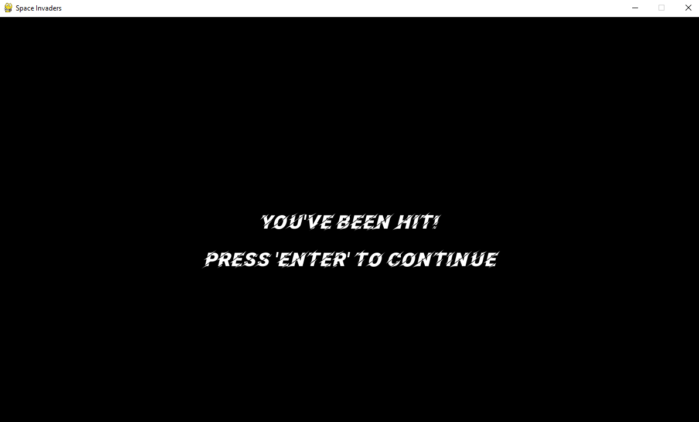

# Space Invaders

The **Space Invaders** project is a Python-based game created as part of my **Computer Graphics** class during my second year of college. This project demonstrates core game development concepts such as rendering, event handling, and sprite manipulation using **Pygame**. While much of the base code was provided by my professor, I focused on implementing the game using Pygame, loading images, and adding custom graphical enhancements.

## 👾 About the Game
This version of **Space Invaders** offers a unique twist on the classic game:
- **Dynamic Colors**: Each time the spaceship shoots, it changes color, and the aliens also change their colors randomly.
- **Custom Graphics**: The spaceship and alien designs were created using **Inkscape** and imported into the game as SVGs.
- **Interactive Gameplay**: Shoot down the aliens to earn points and defend the galaxy!

## 🚀 Features
- **Randomized Visuals**: Alien colors change randomly, and the spaceship changes color with each shot.
- **Custom Sprites**: Graphics for the spaceship and aliens were designed in **Inkscape**.
- **Smooth Game Mechanics**: Built with Pygame for fluid animations and responsive controls.

## 🛠️ Technologies Used
- **Programming Language**: Python
- **Libraries/Modules**:
  - [Pygame](https://www.pygame.org/) (for game mechanics and graphics)
  - [random](https://docs.python.org/3/library/random.html) (for random color changes)
  - [Inkscape](https://inkscape.org/) (for designing SVG graphics)

## 📦 Installation and Setup
To play **Space Invaders** on your local machine, follow these steps:

1. Clone the repository:
   ```bash
   git clone https://github.com/DaveTron4/Space-Invaders.git
   cd Space-Invaders
   ```

2. Install the required dependencies: Ensure you have Python installed, then install Pygame:

    ```bash
    pip install pygame
    ```

3. Run the game:

    ```bash
    python main.py
    ```

---

## 🎓 Learning Outcome

This project helped me:

- Gain experience working with **Pygame** to implement and manage game logic.
- Learn how to load and manipulate custom graphics, such as SVGs, in a Python game.
- Explore creative design and randomness by implementing dynamic color changes for game elements.

---

## 🖼️ Screenshot





---

## 📜 License

This project is open source and available under the [MIT License](LICENSE).

---

## 🤝 Contributing

Feel free to fork this repository, submit issues, or suggest improvements! Contributions are always welcome.